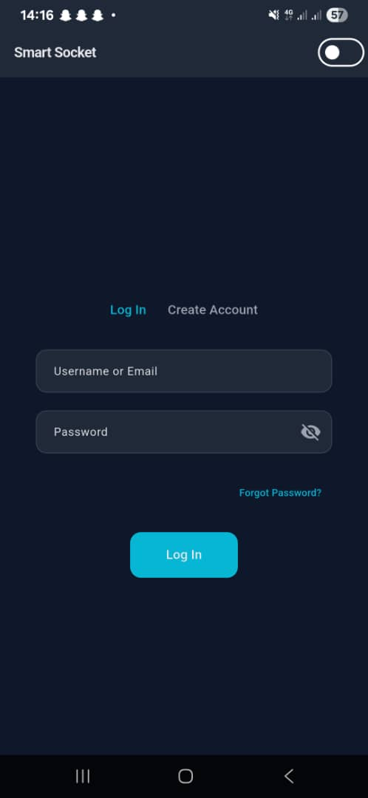
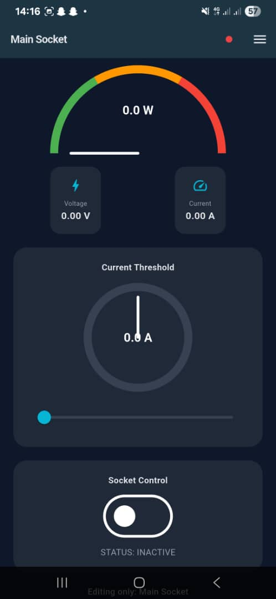

<<<<<<< HEAD
# Socket
>>>>>>> 2c22662 (Refactor local database, update Flutter + ESP32 Firebase integration)

A new Flutter project.

## Getting Started

This project is a starting point for a Flutter application.

A few resources to get you started if this is your first Flutter project:

- [Lab: Write your first Flutter app](https://docs.flutter.dev/get-started/codelab)
- [Cookbook: Useful Flutter samples](https://docs.flutter.dev/cookbook)

For help getting started with Flutter development, view the
[online documentation](https://docs.flutter.dev/), which offers tutorials,
samples, guidance on mobile development, and a full API reference.
=======
# Socket-app
A work-in-progress Flutter app featuring offline login, secure local database, and a customizable user dashboard. The app includes theme switching, notification settings, and login auditing, designed for learning and demonstration purposes.
# Socket App – Flutter Mobile Application

⚠️ **Work in Progress**  
This app is under development and may contain bugs. Features and UI may change as development continues.

---

## Description
A smart socket/energy management app that monitors voltage, power, and energy usage from various sockets, alerts users to overuse or excess, allows remote safe shutdown of individual sockets, and provides insights on how to save power effectively.
<<<<<<< HEAD

=======
>>>>>>> 2c22662 (Refactor local database, update Flutter + ESP32 Firebase integration)
---

## Features
- Offline login with email or username
- Secure local database (SQLite)
- Online syncing with Firebase
- Role-based user dashboard
- Theme switching (Light / Dark mode)
- Notification toggles (sound & vibration)
- Login auditing (tracks user activity)
- User settings management

---

## Screenshots

  

### Disconnected Version


### Connected Version
.jpeg)


---

## Technologies Used
- Flutter & Dart
- SQLite for local database
- Firebase for online syncing
- Shared Preferences for settings
- MVC architecture

---

## How to Run
1. Clone the repository:
```bash
git clone https://github.com/Histrionic/Socket-app.git
>>>>>>> 8f204b3df980bf7f010bcfda58f3167eff7f3ac7
